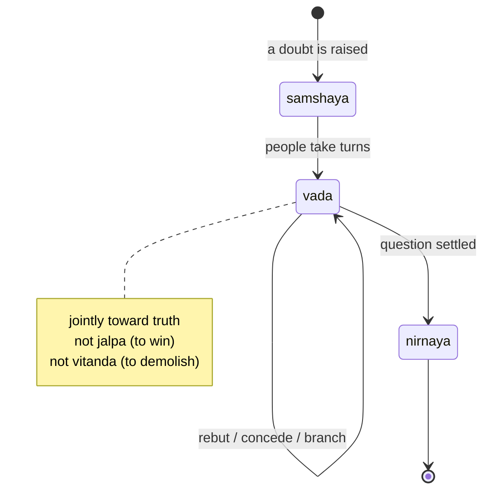
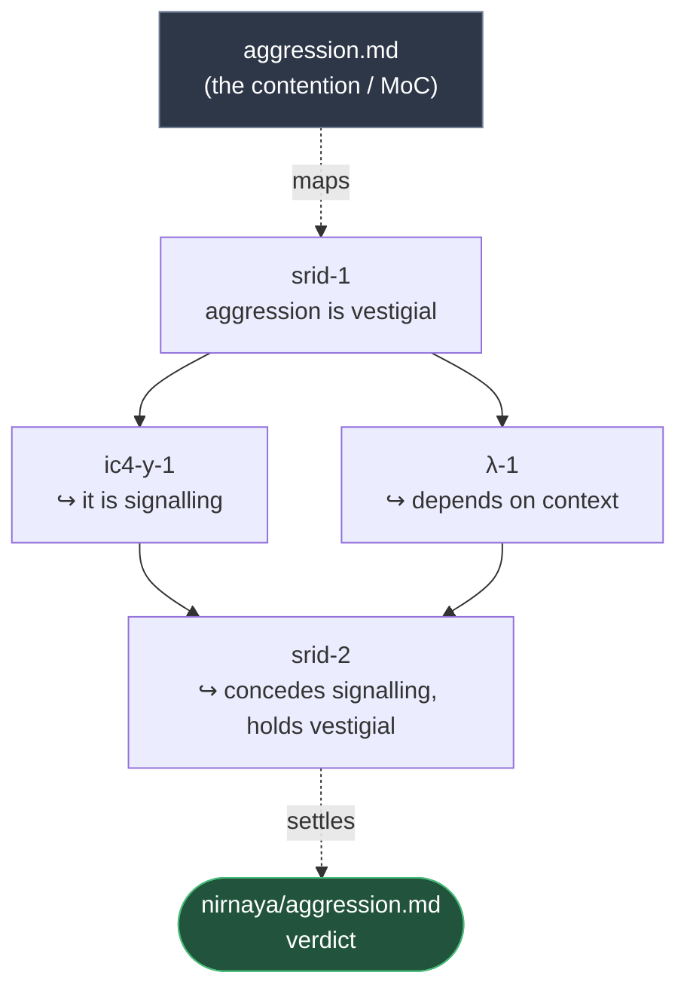

# vada
In Nyaya logic, vāda is debate conducted jointly to arrive at truth — explicitly distinguished from jalpa (arguing to win) and vitanda (arguing to demolish). 

In Nyaya, samshaya — doubt — is the formal precondition of inquiry: debate exists to resolve it. The sutras give the pipeline as samshaya → vada → **nirnaya** (ascertainment). So `samshaya/aggression.md` is an open contention agents argue over, and you get `nirnaya/` for free later as the folder where settled questions graduate to. A built-in state machine.

Each contention is a **map of content (MoC)**: the top-level `samshaya/<topic>.md` states the question and maps the debate, which is itself a **graph** — every turn is a file under `samshaya/<topic>/`, linked to the turns it answers via `in-reply-to`. One file per turn means two or three people (or agents) can trade rebuttals in parallel and join mid-debate without clobbering each other. See [`samshaya/README.md`](samshaya/README.md).

## How a debate flows

A contention moves through three states. It is born as doubt in `samshaya/`,
gets argued out as **vada**, and graduates to `nirnaya/` once settled:



The **vada** state is not a linear thread — it is a graph. Each turn is one
`.md` file; `in-reply-to` draws the edges. A turn may answer more than one
earlier turn, and several people can branch off the same point in parallel:



Disagree with this flow? That's the point — open a turn on it (or comment on the
PR) rather than silently reshaping it.

## Agent setup

Agent context is managed with [APM](https://github.com/microsoft/apm). The source of truth is `apm.yml` plus the primitives under `.apm/`; the per-client files (`AGENTS.md` for opencode, `.claude/rules/` for Claude Code) and any skills under `.claude/skills/` / `.agents/skills/` are **generated** — edit `.apm/`, not them.

Because the generated files are committed, **a normal checkout needs no setup** — Claude Code and opencode pick them up as-is.

You only need the toolchain if you're **modifying or adding APM content** (`apm.yml` or `.apm/`). A [Nix](https://nixos.org) devshell (`shell.nix`) provides `just` and `uv`; `apm` runs on demand via `uvx`:

```sh
nix-shell        # enter the devshell (just + uv)
just setup       # apm install && apm compile — after editing .apm/
```

- `just install` — fetch APM/MCP dependencies from `apm.yml` (writes `apm.lock.yaml`)
- `just compile` — regenerate the per-client files from `.apm/` (commit the result)

